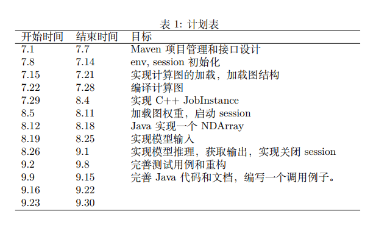
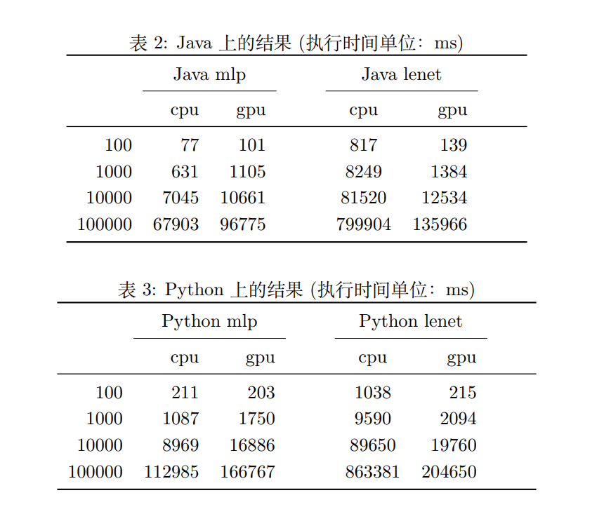

# oneflow-java

为 OneFlow 添加新的前端语言

# 成果总结

完成了计划表所述内容，下面总结这段时间的成果。

## Java 前端

Java 前端支持 OneFlow 推理的功能，可以加载模型，进行前向传播。

Java 前端的代码分为两个部分，一个是 native 代码，一个是 Java 代码。

native 代码，可以看 submodule，或者前往这个 [PR](https://github.com/Oneflow-Inc/oneflow/pull/5115) 查看更多的信息，或者直接前往这个[分支](https://github.com/zzk0/oneflow/tree/libOneFlow_java)。

Java 代码，放在 liboneflow 这个文件下面。

## OneFlow Java API 教程

地址：https://www.yuque.com/docs/share/9e5691a9-a46f-4aae-ab6d-b63c2e21a38c

这篇教程由三部分组成：

第一部分：模型。在这个部分中，我们将使用 OneFlow 在 mnist 数据集上训练一个手写体识别的模型，并且将这个模型保存下来；你也可以跳过这个步骤，直接下载模型。

第二部分：环境准备。准备 Java 的环境，下载 Jar 包，将 Jar 包安装到本地 Maven 仓库，使用 IDEA 新建 Maven 项目。

第三部分：介绍 OneFlow 的 Java API，并且使用这个 API 搭建一个识别手写体图片的命令行工具。

## 使用例程

例程代码在 oneflow-example 下面。

## 项目经验分享

微信文章：https://mp.weixin.qq.com/s/-2Am97QOC4BpNzJLVcbhdg

博客园：https://www.cnblogs.com/zzk0/p/15191920.html

这篇项目经验分享的文章，简单介绍了这个项目的任务、目标、意义。梳理了 OneFlow 各个流程，详细记录了实施的过程，记录探索、设计、重构的各个阶段。

## OneFlow 源码分析

为了对 OneFlow 源码有更加深刻的理解，了解内部的设计和构造，读了读 OneFlow 的设计，写了几篇源码分析笔记。

- 初始化环境：https://www.cnblogs.com/zzk0/p/15212161.html
- Python 端构图：https://www.cnblogs.com/zzk0/p/15213127.html
- 从 Op 到 Job：https://www.cnblogs.com/zzk0/p/15216185.html
- 启动 Session：https://www.cnblogs.com/zzk0/p/15217438.html
- 从 Job 到 Plan：https://www.cnblogs.com/zzk0/p/15222259.html
- 启动 Runtime：https://www.cnblogs.com/zzk0/p/15226851.html
- 计算数据的来源：https://www.cnblogs.com/zzk0/p/15230583.html
- softmax 的分析：https://www.cnblogs.com/zzk0/p/15173022.html
- Python 端构图的另一篇分析：https://www.cnblogs.com/zzk0/p/15009227.html

## 尝试迁移 CRF

尝试迁移了 pytorch-crf 到 oneflow：

https://gitlab.summer-ospp.ac.cn/summer2021/210130141/-/blob/master/models/crf_oneflow.py

oneflow 的动态图和 pytorch 接口基本兼容，除了 max 接口，其他接口基本一致。所以整个迁移过程很快就完成了。

本来计划尝试使用这个 CRF 去构建模型，不过遇到了一些困难。先使用 Pytorch 在 CoNLL 2003 数据集上复现经典论文 BiLSTM-CRF，因为模型简单，所以很快搭建好了。不过一直没有精度，调整了超参数也没有达到，寻找了很久的 BUG，但是没有找到，大概率是因为没有完全按照论文所说的方式提取特征所导致的。

## 中期报告

[中期报告](./周泽楷+210130141.pdf)

## 结项报告

[结项报告](./周泽楷+210130141_结项.pdf)

## 性能对比

下面的初步实验表明，Java 接口相比 Python 接口在推理性能上减少了 33.5% ~ 41.9% 的推理时间。

